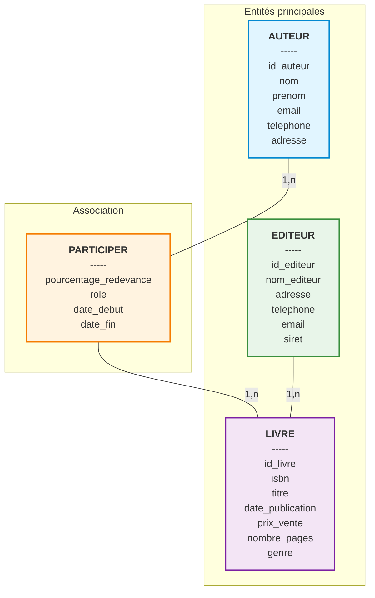

# Modèle Conceptuel de Données (MCD)

## 🎯 Objectif

Modéliser le système de calcul des redevances pour un groupe d'édition selon les règles MERISE.

## 📊 Diagramme Conceptuel

## 🔍 Description des Entités

### AUTEUR
Représente un auteur qui peut participer à la création de plusieurs livres.

**Attributs :**
- `id_auteur` (PK) : Identifiant unique
- `nom` : Nom de famille
- `prenom` : Prénom
- `email` : Adresse email
- `telephone` : Numéro de téléphone
- `adresse` : Adresse postale complète

### LIVRE
Représente un ouvrage publié par un éditeur.

**Attributs :**
- `id_livre` (PK) : Identifiant unique
- `isbn` : Numéro ISBN unique
- `titre` : Titre du livre
- `date_publication` : Date de parution
- `prix_vente` : Prix de vente en euros
- `nombre_pages` : Nombre de pages
- `genre` : Genre littéraire

### EDITEUR
Représente une maison d'édition.

**Attributs :**
- `id_editeur` (PK) : Identifiant unique
- `nom_editeur` : Raison sociale
- `adresse` : Adresse du siège
- `telephone` : Numéro de contact
- `email` : Email de contact
- `siret` : Numéro SIRET

## 🔗 Association PARTICIPER

Représente la collaboration entre un auteur et un livre avec attribution de droits.

**Attributs :**
- `pourcentage_redevance` : Pourcentage des droits d'auteur (0-100)
- `role` : Rôle de l'auteur (auteur principal, co-auteur, traducteur, illustrateur)
- `date_debut` : Date de début de la collaboration
- `date_fin` : Date de fin (nullable si toujours active)

**Cardinalités :**
- Un AUTEUR peut PARTICIPER à 1 ou plusieurs LIVRES (1,n)
- Un LIVRE peut avoir 1 ou plusieurs AUTEURS qui y PARTICIPENT (1,n)
- Un EDITEUR publie 1 ou plusieurs LIVRES (1,n)
- Un LIVRE est publié par 1 seul EDITEUR (1,1)

## ✅ Règles de gestion

1. Un livre doit avoir au moins un auteur participant
2. Un auteur peut participer à plusieurs livres
3. La somme des pourcentages de redevance pour un même livre doit égaler 100%
4. Un livre est publié par un seul éditeur
5. Un éditeur peut publier plusieurs livres
6. Le rôle définit la nature de la participation (auteur principal, co-auteur, traducteur, etc.)
7. Les dates permettent de tracer l'historique des collaborations

## 🎨 Contraintes d'intégrité

- **Unicité** : ISBN unique par livre
- **Validation** : Pourcentage entre 0 et 100
- **Référentiel** : Un livre ne peut exister sans éditeur
- **Temporelle** : date_fin >= date_debut (si renseignée)
- **Métier** : Σ(pourcentage_redevance) = 100 par livre
