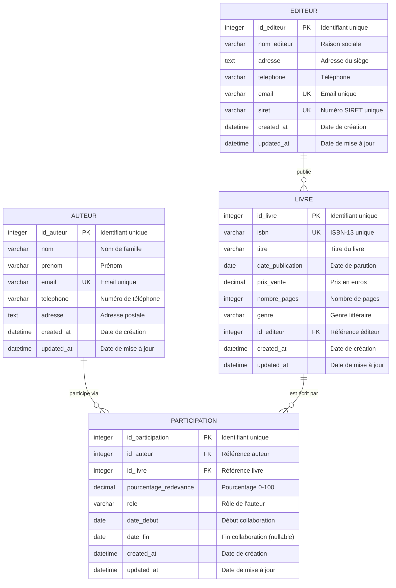

# Modèle Logique de Données (MLD)

## 🎯 Objectif

Transformation du MCD en modèle relationnel avec toutes les contraintes SQL nécessaires.

## 📊 Diagramme ERD



## 🗂️ Structure Relationnelle

### Table AUTEUR
```
AUTEUR (
    id_auteur INTEGER PK,
    nom VARCHAR(100) NOT NULL,
    prenom VARCHAR(100) NOT NULL,
    email VARCHAR(255) UNIQUE NOT NULL,
    telephone VARCHAR(20),
    adresse TEXT,
    created_at DATETIME DEFAULT CURRENT_TIMESTAMP,
    updated_at DATETIME DEFAULT CURRENT_TIMESTAMP
)
```

**Contraintes :**
- PK : `id_auteur`
- UNIQUE : `email`
- NOT NULL : `nom`, `prenom`, `email`

---

### Table EDITEUR
```
EDITEUR (
    id_editeur INTEGER PK,
    nom_editeur VARCHAR(200) NOT NULL,
    adresse TEXT,
    telephone VARCHAR(20),
    email VARCHAR(255) UNIQUE NOT NULL,
    siret VARCHAR(14) UNIQUE NOT NULL,
    created_at DATETIME DEFAULT CURRENT_TIMESTAMP,
    updated_at DATETIME DEFAULT CURRENT_TIMESTAMP
)
```

**Contraintes :**
- PK : `id_editeur`
- UNIQUE : `email`, `siret`
- NOT NULL : `nom_editeur`, `email`, `siret`
- CHECK : `LENGTH(siret) = 14`

---

### Table LIVRE
```
LIVRE (
    id_livre INTEGER PK,
    isbn VARCHAR(17) UNIQUE NOT NULL,
    titre VARCHAR(300) NOT NULL,
    date_publication DATE NOT NULL,
    prix_vente DECIMAL(10,2) NOT NULL,
    nombre_pages INTEGER NOT NULL,
    genre VARCHAR(100),
    id_editeur INTEGER NOT NULL,
    created_at DATETIME DEFAULT CURRENT_TIMESTAMP,
    updated_at DATETIME DEFAULT CURRENT_TIMESTAMP,
    FOREIGN KEY (id_editeur) REFERENCES EDITEUR(id_editeur)
)
```

**Contraintes :**
- PK : `id_livre`
- UNIQUE : `isbn`
- FK : `id_editeur` → `EDITEUR(id_editeur)`
- NOT NULL : `isbn`, `titre`, `date_publication`, `prix_vente`, `nombre_pages`, `id_editeur`
- CHECK : `prix_vente > 0`
- CHECK : `nombre_pages > 0`
- CHECK : `LENGTH(isbn) IN (10, 13, 17)` (ISBN-10 ou ISBN-13 avec tirets)
- TRIGGER : `date_publication <= DATE('now')` (via trigger, car CHECK non-déterministe interdit)

---

### Table PARTICIPATION
```
PARTICIPATION (
    id_participation INTEGER PK,
    id_auteur INTEGER NOT NULL,
    id_livre INTEGER NOT NULL,
    pourcentage_redevance DECIMAL(5,2) NOT NULL,
    role VARCHAR(100) NOT NULL,
    date_debut DATE NOT NULL,
    date_fin DATE,
    created_at DATETIME DEFAULT CURRENT_TIMESTAMP,
    updated_at DATETIME DEFAULT CURRENT_TIMESTAMP,
    FOREIGN KEY (id_auteur) REFERENCES AUTEUR(id_auteur),
    FOREIGN KEY (id_livre) REFERENCES LIVRE(id_livre),
    UNIQUE (id_auteur, id_livre, role)
)
```

**Contraintes :**
- PK : `id_participation`
- FK : `id_auteur` → `AUTEUR(id_auteur)`
- FK : `id_livre` → `LIVRE(id_livre)`
- UNIQUE : Combinaison `(id_auteur, id_livre, role)`
- NOT NULL : `id_auteur`, `id_livre`, `pourcentage_redevance`, `role`, `date_debut`
- CHECK : `pourcentage_redevance BETWEEN 0 AND 100`
- CHECK : `date_fin IS NULL OR date_fin >= date_debut` (comparaison entre colonnes, accepté par SQLite)
- CHECK : `role IN ('auteur principal', 'co-auteur', 'traducteur', 'illustrateur', 'préfacier')`
- TRIGGER : `date_debut <= DATE('now')` (via trigger, car CHECK avec DATE('now') non-déterministe interdit)

---

## 🔑 Index Recommandés

Pour optimiser les performances des requêtes fréquentes :

```sql
-- Index sur les clés étrangères
CREATE INDEX idx_livre_editeur ON LIVRE(id_editeur);
CREATE INDEX idx_participation_auteur ON PARTICIPATION(id_auteur);
CREATE INDEX idx_participation_livre ON PARTICIPATION(id_livre);

-- Index sur les champs de recherche
CREATE INDEX idx_auteur_nom ON AUTEUR(nom, prenom);
CREATE INDEX idx_livre_titre ON LIVRE(titre);
CREATE INDEX idx_livre_isbn ON LIVRE(isbn);
CREATE INDEX idx_livre_date_publication ON LIVRE(date_publication);

-- Index composites pour les vues
CREATE INDEX idx_participation_dates ON PARTICIPATION(date_debut, date_fin);
```

## ⚠️ Règles Métier

### Contrainte de cohérence des pourcentages
La somme des pourcentages de redevance pour un même livre doit être égale à 100%.
Cette contrainte sera vérifiée via :
- Un TRIGGER sur INSERT/UPDATE de PARTICIPATION
- Une fonction de validation dans la vue comptable

### Contrainte de validation des dates (via TRIGGERS)
**Justification technique** : SQLite interdit les fonctions non-déterministes (comme `DATE('now')`) dans les contraintes CHECK.  
**Solution adoptée** : Utilisation de TRIGGERS pour valider :
- `date_publication <= DATE('now')` pour LIVRE
- `date_debut <= DATE('now')` pour PARTICIPATION

Ces triggers offrent la même garantie d'intégrité qu'un CHECK, tout en respectant les limitations de SQLite.

### Contrainte de suppression en cascade
- Si un EDITEUR est supprimé → Erreur (protège les livres)
- Si un AUTEUR est supprimé → Erreur (protège les participations)
- Si un LIVRE est supprimé → Supprime les PARTICIPATIONs associées (CASCADE)

### Audit et traçabilité
Les champs `created_at` et `updated_at` permettent de :
- Tracer les modifications
- Auditer les créations de contrats
- Gérer l'historique des redevances

## 🔄 Normalisation

Le modèle respecte la **3ème Forme Normale (3FN)** :
- ✅ 1FN : Tous les attributs sont atomiques
- ✅ 2FN : Pas de dépendances partielles aux clés
- ✅ 3FN : Pas de dépendances transitives

**Justification :**
- Chaque table a une clé primaire unique
- Les attributs non-clés dépendent uniquement de la clé primaire
- Pas de redondance d'information
